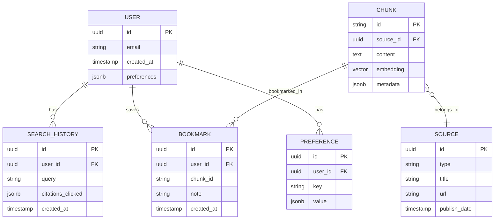

# feat: Autography - PM Knowledge Base with Citable Evidence

> **The open evidence of product management**

## Overview

Autography is an indexable chatbot that surfaces citable evidence from curated product management, entrepreneurship, and design content. Users ask long-tail questions and receive synthesized answers with inline citations linking to specific podcast timestamps, book passages, and article sections.

**Name**: Autography (A-U-T-O-G-R-A-P-H-Y)

---

## Problem Statement

Product managers, founders, and designers need actionable insights from trusted sources but face:

1. **Information overload** - Hundreds of podcast episodes, dozens of books, countless articles
2. **No citation chain** - AI tools synthesize but don't show sources
3. **Discovery friction** - Finding the *right* insight for a *specific* situation requires hours
4. **Memory decay** - "I heard this on a podcast but can't remember which one"

Autography solves this by making expert knowledge **searchable, citable, and discoverable**.

---

## Proposed Solution

A chat-style search interface where users:
1. Ask natural language questions about PM, founders, or design
2. Receive AI-synthesized answers with **inline citations**
3. Click citations to view full context with timestamps/page numbers
4. Explore follow-up questions and related content
5. Build personalized knowledge collections over time

---

## Data Sources

### Available Now

| Source | Format | Volume | Access Method |
|--------|--------|--------|---------------|
| **Lenny's Podcast** | Markdown transcripts | 269 episodes | [GitHub repo](https://github.com/ChatPRD/lennys-podcast-transcripts) |

### Requires Transcription

| Source | Format | Volume | Transcription Method |
|--------|--------|--------|---------------------|
| **Founders Podcast** | Audio (YouTube) | ~350+ episodes | Whisper API or [Tapesearch](https://www.tapesearch.com/podcast/founders/1141877104) |
| **David Senra Podcast** | Audio | ~15 episodes (since Sept 2025) | Whisper API |

**Recent David Senra guests**: Tobi Lütke (Shopify), John Mackey (Whole Foods), Patrick O'Shaughnessy, James Dyson, Michael Ovitz, Todd Graves, Brad Jacobs

### Requires Curation

| Source | Format | Volume | Approach |
|--------|--------|--------|----------|
| **John Cutler** | Blog posts, articles | ~1000+ posts | Scrape with permission or manual curation |
| **Top 20 PM Books** | Text | 20 books | Fair-use excerpts (1-2 sentences per quote) |

### Canonical Book List

1. *The Design of Everyday Things* - Don Norman
2. *The Hard Thing About Hard Things* - Ben Horowitz
3. *The Making of a Manager* - Julie Zhuo
4. *Team Topologies* - Matthew Skelton & Manuel Pais
5. *Don't Make Me Think* - Steve Krug
6. *Inspired* - Marty Cagan
7. *Continuous Discovery Habits* - Teresa Torres
8. *Escaping the Build Trap* - Melissa Perri
9. *The Lean Startup* - Eric Ries
10. *Zero to One* - Peter Thiel
11. *Good Strategy Bad Strategy* - Richard Rumelt
12. *Thinking in Bets* - Annie Duke
13. *The Mom Test* - Rob Fitzpatrick
14. *Hooked* - Nir Eyal
15. *Measure What Matters* - John Doerr
16. *High Output Management* - Andy Grove
17. *The Innovator's Dilemma* - Clayton Christensen
18. *Crossing the Chasm* - Geoffrey Moore
19. *Atomic Habits* - James Clear
20. *Shape Up* - Ryan Singer

---

## Technical Architecture

```
┌─────────────────────────────────────────────────────────────────────────┐
│                           FRONTEND (Next.js 15)                         │
│  ┌───────────────────────────────────────────────────────────────────┐ │
│  │  App Router + Server Components + Vercel AI SDK                   │ │
│  │  - Streaming chat with useChat hook                               │ │
│  │  - Citation cards with expand/collapse                            │ │
│  │  - "Surprise Me" + topic browsing                                 │ │
│  │  - User memory sidebar (saved queries, bookmarks)                 │ │
│  └───────────────────────────────────────────────────────────────────┘ │
└─────────────────────────────────────────────────────────────────────────┘
                                    │
                                    ▼
┌─────────────────────────────────────────────────────────────────────────┐
│                        PYTHON BACKEND (FastAPI)                         │
│  ┌─────────────────┐  ┌─────────────────┐  ┌─────────────────────────┐ │
│  │ Query           │  │ LlamaIndex      │  │ Citation                │ │
│  │ Understanding   │──│ Chat Engine     │──│ Extraction              │ │
│  │ (LLM rewrite)   │  │ (condense+ctx)  │  │ & Formatting            │ │
│  └─────────────────┘  └─────────────────┘  └─────────────────────────┘ │
└─────────────────────────────────────────────────────────────────────────┘
                                    │
                                    ▼
┌─────────────────────────────────────────────────────────────────────────┐
│                         RETRIEVAL LAYER                                 │
│  ┌───────────────────────────────────────────────────────────────────┐ │
│  │                    HYBRID SEARCH (RRF)                            │ │
│  │  ┌────────────────────┐    ┌────────────────────┐                │ │
│  │  │ Dense Embeddings   │ +  │ Sparse Keywords    │  → Re-ranking  │ │
│  │  │ (text-embed-3-lg)  │    │ (BM25 via sparse)  │    (BGE v2)    │ │
│  │  └────────────────────┘    └────────────────────┘                │ │
│  │           Weights: 70% semantic / 30% keyword                     │ │
│  └───────────────────────────────────────────────────────────────────┘ │
└─────────────────────────────────────────────────────────────────────────┘
                                    │
                                    ▼
┌─────────────────────────────────────────────────────────────────────────┐
│                         STORAGE LAYER                                   │
│  ┌────────────────────────────────┐  ┌────────────────────────────────┐│
│  │          ChromaDB              │  │        SQLite/Postgres         ││
│  │  - Vector embeddings           │  │  - User accounts               ││
│  │  - Sparse embeddings           │  │  - Search history              ││
│  │  - Rich metadata per chunk     │  │  - Bookmarks/saves             ││
│  │  - ~500K chunks estimated      │  │  - Personalization data        ││
│  └────────────────────────────────┘  └────────────────────────────────┘│
└─────────────────────────────────────────────────────────────────────────┘
```

---

## Technical Specifications

### ChromaDB Hybrid Search (from Context7 2026 docs)

```python
from chromadb import Search, K, Knn, Rrf

def hybrid_search(query: str, filters: dict = None, limit: int = 50):
    """
    Hybrid search combining dense + sparse embeddings with RRF.
    Based on latest ChromaDB API (2026).
    """
    # Create RRF ranking with configurable weights
    hybrid_rank = Rrf(
        ranks=[
            Knn(query=query, return_rank=True, limit=300),  # Dense
            Knn(query=query, key="sparse_embedding", return_rank=True, limit=300)  # Sparse
        ],
        weights=[0.7, 0.3],  # 70% semantic, 30% keyword
        k=60  # RRF constant
    )

    # Build search with optional metadata filtering
    search = Search().rank(hybrid_rank).limit(limit)

    if filters:
        filter_conditions = None
        for key, value in filters.items():
            condition = K(key) == value
            filter_conditions = condition if not filter_conditions else filter_conditions & condition
        search = search.where(filter_conditions)

    # Select citation-relevant fields
    search = search.select(
        K.DOCUMENT, K.SCORE,
        "source_type", "source_title", "episode_id",
        "start_time", "end_time", "speaker",
        "chunk_index", "source_url", "publish_date"
    )

    return collection.search(search)
```

### LlamaIndex Chat Engine with Streaming

```python
from llama_index.core import VectorStoreIndex
from llama_index.vector_stores.chroma import ChromaVectorStore

# Create chat engine with citation tracking
chat_engine = index.as_chat_engine(
    chat_mode="condense_plus_context",
    streaming=True,
    similarity_top_k=10,
    verbose=True
)

# Stream chat with follow-up awareness
response_stream = chat_engine.stream_chat(
    "How should I structure my product team?"
)

# Process streaming tokens
for token in response_stream.response_gen:
    yield {"type": "token", "content": token}

# After completion, yield citations
for node in response_stream.source_nodes:
    yield {
        "type": "citation",
        "text": node.node.get_content()[:200],
        "source": node.node.metadata.get("source_title"),
        "timestamp": node.node.metadata.get("start_time"),
        "score": round(node.score, 3)
    }
```

### Next.js Streaming Chat API

```typescript
// app/api/chat/route.ts
import { anthropic } from '@ai-sdk/anthropic';
import { streamText } from 'ai';

export async function POST(req: Request) {
  const { messages, context } = await req.json();

  const response = streamText({
    model: anthropic('claude-sonnet-4-20250514'),
    system: `You are Autography, a warm and knowledgeable assistant
             helping users explore product management wisdom.
             Always cite your sources using [1], [2] notation.
             Be conversational but precise.`,
    messages,
  });

  return response.toTextStreamResponse();
}
```

### Chunking Strategy for Transcripts

```python
CHUNK_CONFIG = {
    "target_size": 512,        # tokens (optimal per 2025 research)
    "overlap": 100,            # tokens (~20% overlap)
    "respect_boundaries": True, # Don't split mid-sentence
    "speaker_aware": True,      # Keep speaker turns together
}

METADATA_SCHEMA = {
    "chunk_id": str,           # Deterministic hash
    "source_type": str,        # "podcast", "book", "article"
    "source_title": str,       # Episode/book title
    "episode_id": str,         # For podcasts
    "speaker": str,            # Who said this
    "start_time": str,         # "00:15:32" for podcasts
    "end_time": str,
    "page_number": int,        # For books
    "publish_date": str,
    "source_url": str,         # Link to original
    "topic_tags": list,        # Auto-generated topics
    "chunk_index": int,        # Position in document
}
```

### Embedding Model Selection

| Model | Dimensions | Use Case | Cost |
|-------|------------|----------|------|
| `text-embedding-3-large` | 3072 | Primary embeddings | $0.13/1M tokens |
| `voyage-3-large` | 512-2048 | Alternative (better retrieval) | $0.06/1M tokens |
| `BGE-M3` | 1024 | Open source option | Free (self-hosted) |

**Recommendation**: Start with `text-embedding-3-large` for simplicity, evaluate `voyage-3-large` for production optimization.

### Re-ranking with Cross-Encoder

```python
from sentence_transformers import CrossEncoder

reranker = CrossEncoder("BAAI/bge-reranker-v2-m3")

def rerank_results(query: str, documents: list, top_k: int = 10):
    """Re-rank hybrid search results for final quality."""
    pairs = [(query, doc["text"]) for doc in documents]
    scores = reranker.predict(pairs)

    for doc, score in zip(documents, scores):
        doc["rerank_score"] = float(score)

    return sorted(documents, key=lambda x: x["rerank_score"], reverse=True)[:top_k]
```

---

## User Flows

### Flow 1: Core Search

```
User enters question → Query understanding (LLM rewrite) →
Hybrid search (50 candidates) → Re-rank (top 10) →
AI synthesis with inline [1], [2] citations →
Display answer with citation cards → Generate 3 follow-up questions
```

### Flow 2: Citation Deep-Dive

```
User clicks citation [1] → Expand to show full context →
Display surrounding transcript (±500 chars) →
Show "Jump to source" link (podcast timestamp or book page) →
Related citations from same episode/chapter
```

### Flow 3: "Surprise Me"

```
User clicks "Surprise Me" → Select from curated "gems" collection →
Display unexpected insight with context →
"Want another?" or "Tell me more about this"
```

### Flow 4: Personalization

```
User searches over time → Track query patterns →
Infer interests (prioritization, hiring, growth, etc.) →
Weight future results toward interests →
Show "Based on your interests" recommendations
```

---

## Data Model

### Chunk (ChromaDB)

```typescript
interface Chunk {
  id: string;                    // Deterministic hash
  document: string;              // The actual text content
  embedding: number[];           // Dense vector
  sparse_embedding: number[];    // Sparse vector for BM25
  metadata: {
    source_type: "podcast" | "book" | "article";
    source_title: string;
    source_url: string;
    episode_id?: string;
    speaker?: string;
    start_time?: string;         // "00:15:32"
    end_time?: string;
    page_number?: number;
    chapter?: string;
    publish_date: string;
    topic_tags: string[];
    chunk_index: number;
  };
}
```

### User (Postgres)

```typescript
interface User {
  id: string;
  email?: string;
  created_at: Date;
  preferences: {
    preferred_sources: string[];
    topic_weights: Record<string, number>;
  };
}

interface SearchHistory {
  id: string;
  user_id: string;
  query: string;
  citations_clicked: string[];
  timestamp: Date;
}

interface Bookmark {
  id: string;
  user_id: string;
  chunk_id: string;
  note?: string;
  created_at: Date;
}
```

---

## UI Design

### Design Tokens (Warm & Modern)

```css
:root {
  --cream: #FDF8F3;
  --sand: #E8DDD4;
  --stone: #9A8C7B;
  --terracotta: #C45A3B;
  --charcoal: #3D3833;
  --gold: #D4A84B;

  --shadow-soft: 0 2px 8px rgba(61, 56, 51, 0.08);
  --radius-lg: 1rem;
  --radius-xl: 1.5rem;
}
```

### Home Screen Layout

```
┌────────────────────────────────────────────────────────────────────┐
│  AUTOGRAPHY                                    [Memory] [Sources]  │
├────────────────────────────────────────────────────────────────────┤
│                                                                    │
│                    The open evidence of PM                         │
│                                                                    │
│     ╭──────────────────────────────────────────────────────────╮  │
│     │  Ask anything about product, founders, design...         │  │
│     ╰──────────────────────────────────────────────────────────╯  │
│                                                                    │
│     ┌──────────────┐  ┌──────────────┐  ┌──────────────┐         │
│     │  Surprise    │  │   Browse     │  │   Trending   │         │
│     │    Me        │  │   Sources    │  │   Questions  │         │
│     └──────────────┘  └──────────────┘  └──────────────┘         │
│                                                                    │
│  RECENT EXPLORATIONS                                               │
│  ├─ "How to prioritize ruthlessly" · 3 sources                    │
│  ├─ "First 90 days as PM" · 7 sources                             │
│  └─ "When to pivot" · 5 sources                                   │
└────────────────────────────────────────────────────────────────────┘
```

### Results View

```
┌────────────────────────────────────────────────────────────────────┐
│  ← "How should I structure my product pod?"                        │
├────────────────────────────────────────────────────────────────────┤
│                                                                    │
│  The evidence suggests keeping pods to 5-8 people [1]. Include    │
│  a PM, designer, 2-4 engineers, and ideally half a data analyst   │
│  [2]. The key is autonomous ownership of outcomes, not just       │
│  outputs [3].                                                      │
│                                                                    │
│  ┌──────────────────────────────────────────────────────────────┐ │
│  │ [1] LENNY'S PODCAST · Marty Cagan interview    ▾ [Expand]   │ │
│  │ "The ideal team size is 5-8 people. Larger and communication │ │
│  │  overhead kills velocity..."                                  │ │
│  │  ⏱ 00:23:45 · Dec 2024                                       │ │
│  └──────────────────────────────────────────────────────────────┘ │
│                                                                    │
│  ┌──────────────────────────────────────────────────────────────┐ │
│  │ [2] TEAM TOPOLOGIES · Skelton & Pais           ▾ [Expand]   │ │
│  │ "Stream-aligned teams should be long-lived and funded as a   │ │
│  │  product, not a project..."                                   │ │
│  │  📖 Chapter 4, p. 89                                         │ │
│  └──────────────────────────────────────────────────────────────┘ │
│                                                                    │
│  FOLLOW UP                                                         │
│  ├─ "How do pods handle dependencies?"                            │
│  ├─ "What roles are optional in early-stage?"                     │
│  └─ "Examples of successful pod structures at scale?"             │
└────────────────────────────────────────────────────────────────────┘
```

---

## Implementation Phases

### Phase 1: Foundation (Week 1-2)

- [ ] Initialize repository with Next.js 15 + Python backend
- [ ] Set up ChromaDB with test collection
- [ ] Clone Lenny's podcast transcripts repo
- [ ] Build basic ingestion pipeline (Lenny's only)
- [ ] Implement simple semantic search (no hybrid yet)
- [ ] Create minimal chat UI with streaming

**Deliverable**: Can search Lenny's transcripts and get basic results

### Phase 2: Hybrid Search & Citations (Week 3-4)

- [ ] Add sparse embeddings for BM25
- [ ] Implement RRF hybrid search
- [ ] Add cross-encoder re-ranking
- [ ] Build citation extraction and formatting
- [ ] Create citation card component with expand
- [ ] Add source linking (timestamp deep links)

**Deliverable**: Hybrid search with proper citations and source links

### Phase 3: Founders Podcast Ingestion (Week 5-6)

- [ ] Set up Whisper transcription pipeline
- [ ] Transcribe Founders Podcast episodes (or source from Tapesearch)
- [ ] Transcribe David Senra's new podcast episodes
- [ ] Normalize speaker names across sources
- [ ] Add source filtering to search

**Deliverable**: Founders + Lenny content searchable

### Phase 4: Agentic Layer (Week 7-8)

- [ ] Implement query understanding (LLM rewrite)
- [ ] Add multi-hop retrieval for complex queries
- [ ] Build follow-up question generation
- [ ] Create conversation threading
- [ ] Handle conflicting sources gracefully

**Deliverable**: Intelligent query handling with follow-ups

### Phase 5: UI Polish & Features (Week 9-10)

- [ ] Design system implementation (warm theme)
- [ ] "Surprise Me" feature
- [ ] Browse by source/topic view
- [ ] Mobile responsive design
- [ ] Loading states and error handling

**Deliverable**: Polished, production-ready UI

### Phase 6: Personalization & Launch (Week 11-12)

- [ ] User accounts (optional auth)
- [ ] Search history tracking
- [ ] Bookmark/save functionality
- [ ] Interest inference and result weighting
- [ ] Analytics foundation
- [ ] Deploy to production

**Deliverable**: Launched product with personalization

---

## Critical Decisions Required

### Priority 1: Must Answer Before Starting

| Question | Options | Recommendation |
|----------|---------|----------------|
| **Authentication model?** | Required / Optional / Anonymous | Optional auth (anonymous search OK, save requires account) |
| **Founders transcripts source?** | Whisper / Tapesearch / Manual | Whisper API (~$500-1000 budget) |
| **Book excerpts approach?** | Fair use quotes / Summaries / Skip | Fair use (1-2 sentence quotes only) |
| **Hosting?** | Vercel + managed DB / Self-hosted | Vercel + Railway for Postgres + ChromaDB Cloud |

### Priority 2: Can Decide During Implementation

| Question | Options | Default |
|----------|---------|---------|
| **LLM for synthesis?** | Claude / GPT-4 / Mix | Claude Sonnet for quality |
| **Embedding model?** | OpenAI / Voyage / BGE | OpenAI text-embedding-3-large |
| **Conversation persistence?** | Ephemeral / Saved | Ephemeral unless bookmarked |
| **Query rate limit?** | None / Soft / Hard | 50 queries/day free tier |

---

## Edge Cases to Handle

### Search Edge Cases

1. **No results**: Show "No evidence found" with query refinement suggestions
2. **Conflicting sources**: Show both perspectives with "Different views exist..."
3. **Off-topic query**: Politely redirect to PM scope
4. **Prompt injection**: Input sanitization + system prompt hardening

### Data Edge Cases

1. **Missing timestamps**: Show "Timestamp unavailable" with episode link
2. **Duplicate quotes**: Dedupe by content hash, show most authoritative
3. **Speaker misattribution**: Manual review queue for flagged content

---

## Success Metrics

| Metric | Target | Measurement |
|--------|--------|-------------|
| **Retrieval relevance** | >80% relevant in top 5 | Manual evaluation of 100 queries |
| **Citation accuracy** | >95% correct attribution | Spot check citations |
| **User return rate** | >30% weekly return | Analytics |
| **Query satisfaction** | >4.0/5.0 rating | Thumbs up/down feedback |

---

## Cost Estimates

### Initial Setup (One-Time)

| Item | Estimate |
|------|----------|
| Whisper transcription (~400 episodes @ 1hr avg) | $400-800 |
| Initial embedding generation (~500K chunks) | $100-200 |
| **Total Setup** | **~$500-1000** |

### Monthly Operating

| Item | Estimate |
|------|----------|
| LLM inference (1000 queries/day) | $100-300 |
| Embedding new content | $10-20 |
| ChromaDB Cloud (500K vectors) | $50-100 |
| Vercel hosting | $20-50 |
| **Total Monthly** | **~$200-500** |

---

## References

### Documentation
- [ChromaDB Hybrid Search](https://github.com/chroma-core/chroma/blob/main/docs/docs.trychroma.com/markdoc/content/cloud/search-api/hybrid-search.md)
- [LlamaIndex Chat Engine](https://docs.llamaindex.ai/)
- [Vercel AI SDK](https://vercel.com/docs/ai-gateway)
- [Next.js 15 App Router](https://nextjs.org/docs/app)

### Data Sources
- [Lenny's Podcast Transcripts](https://github.com/ChatPRD/lennys-podcast-transcripts) - 269 episodes
- [Founders Podcast](https://www.founderspodcast.com) - ~350+ episodes
- [David Senra Podcast](https://podcasts.apple.com/us/podcast/david-senra/id1836497887) - Started Sept 2025
- [Tapesearch (Founders)](https://www.tapesearch.com/podcast/founders/1141877104) - Third-party transcripts

### Research
- [Tim Ferriss x David Senra Transcript](https://tim.blog/2025/09/26/david-senra-transcript/)
- [RAG Best Practices 2025-2026](https://www.analyticsvidhya.com/blog/2025/06/top-rerankers-for-rag/)
- [Hybrid Search Explained](https://weaviate.io/blog/hybrid-search-explained)

---

## ERD



---

*Plan generated: 2026-01-19*
*Tech stack: Next.js 15 + Python (FastAPI) + ChromaDB + LlamaIndex*
